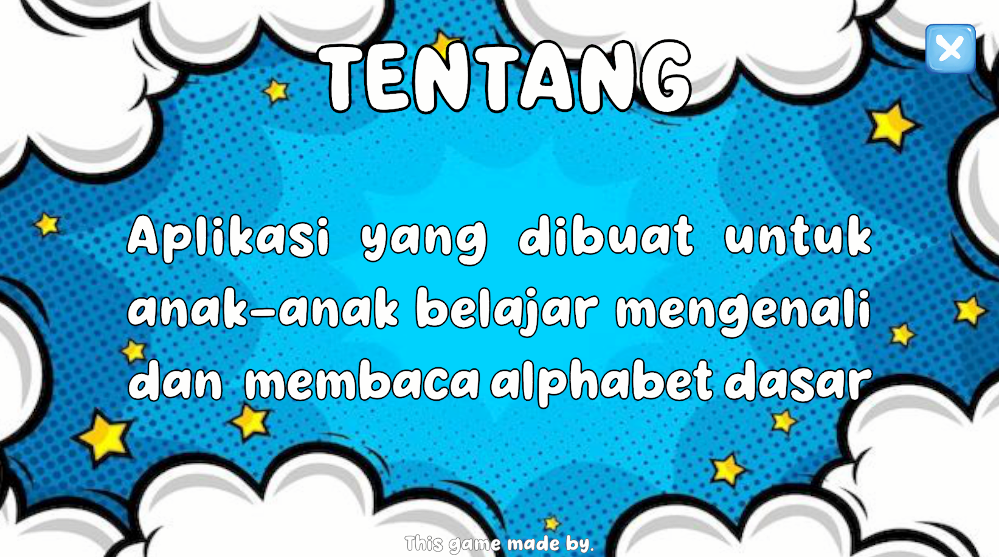
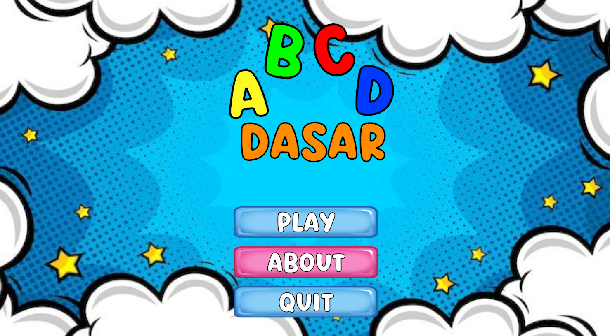

# ABCD-Dasar
Children may learn to identify and read fundamental alphabets in an entertaining and engaging way with this interactive educational application.

# Features
- **Letter Recognition**  
  Recognize the forms of the letters A through Z.

- **Pronunciation Guide**  
  Audio instructions for pronouncing each letter correctly.

- **Attractive Visuals**  
  Vibrant, kid-friendly pictures and animations.

- **Interactive**  
  A kid-friendly UI that is easy to use.

<<<<<<< Updated upstream
# App Preview
A preview of the application interface is provided here:

=======
# 📱 App Preview

>>>>>>> Stashed changes
